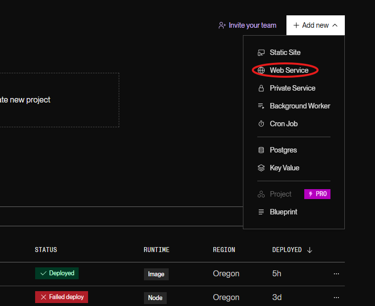

+++
date = '2025-02-21T12:07:18Z'
draft = false
title = 'How to Host a Nostr Relay (for Free*)'
+++
## Background
I love the nostr protocol and I wanted to host a relay. I was going to do this on my raspberry pi but I knew I wouldn't be able to keep it online 24/7. I didn't want to pay for a VPS to host it for me so I looked for a 100% free way to host it, nostr relays are super fast and light so I wasn't concerned about ram limits or cpu limits!

So in my search I found [render](https://onrender.com), a service mainly for serverless hosting of static sites. As it turns out they have a way to deploy docker containers on their free tier. This is how I was able to setup [relay.harljo.uk](https://relay.harljo.uk) for completely free (no credit card required!)

## There are some *issues* with this though...

### Runtime limits
So at the moment your relay is small and likely isn't being used by many people, this use-case is fine for most people though it won’t work for medium-large sized relays. This is because render has a limit of 750 hours of runtime a month. 750 hours is roughly the same as running a server 24/7 for 31 days. This should be enough if you’re not running any other services with them. Otherwise, you’ll need to provide a credit card to cover the costs.

## Slow servers
Another issue you'll encounter is that render's free servers are slow. This is because your relay is only allocated 512MB of RAM and 0.1 of their vCPU. This shouldn't be an issue for most small relays though you might want to consider this before deploying!

## Unreliable connection
When Render spins down your relay, all data is lost, as the free tier doesn't come with persistent storage. When the relay becomes active again, requests may experience a delay of 50 seconds or more.

### Lack of control
The free tier of render doesn't allow SSH access so you can't do normal server admin things :(

## Should I still setup a relay on render?
Yes, but make sure you know the *quirks* of doing it this way!

## I still want to set up a relay for free—how can I do it?

### What do you need?
- A free (or paid) account for [Render](https://onrender.com) 
- A nostr client like [primal](https://primal.net) to connect to the relay 🔌

### Step 1 - Create a new web service
Go to the [Render Dashboard](https://dashboard.render.com), and create a new web service

### Step 2 - Select 'Existing Image'
When you are on the *You are deploying a web service* screen click on *Existing Image*
 

### Step 3 - Connect Docker Image
Paste `docker.io/scsibug/nostr-rs-relay:latest` inside the *Image URL* field and then click *Connect*

### Step 4 - Deploy!
Once you have connected the Docker image, make sure to select the correct server. If you plan on doing this for free* make sure you select that before you deploy!
Once you have done this scroll all the way to the bottom and click *Deploy*!

## Conclusion
Running a Nostr relay for free is possible, but it’s not always the best option. If you're serious about running a relay, you may be able to get a cheap VPS or, even better, self-host it on a Raspberry Pi. Relays aren't very heavy, which is why Nostr remains sustainable. :)